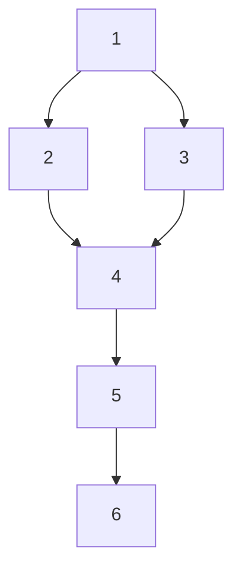

#  Football Team Game

Repo for storing tasks regarding to recruitment task -> [GithubProject](https://github.com/users/schwarzehund/projects/1)

It will contain steps of my preparation as well test scenarios, bugs, and test report.

1. [Gather informations, prepare input parameters and acceptance criteria.](basicinformations.md)
2. [Create test cases.](TestCases.md)
3. [API test cases.](API_TestCases.md)
4. [Conduct tests.](conductTestCases.md) 
5. [Raise a bugs.](bugs.md)
6. [Write test report.](TestReport.md)

